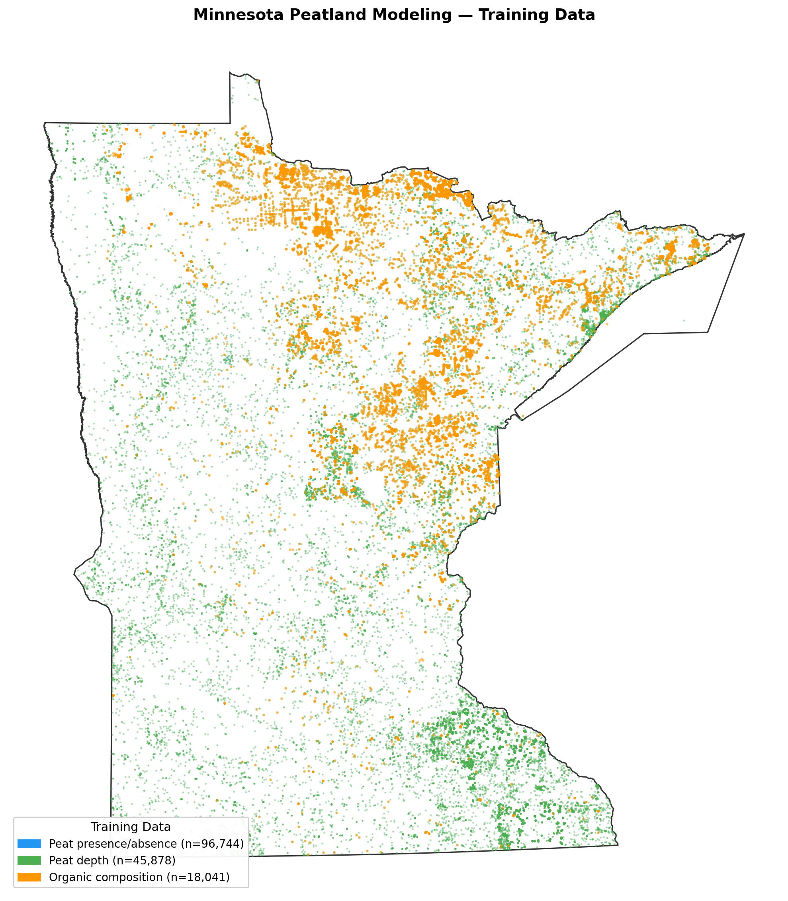

# Point Data Curation

### Point Data Sources

Peat presence, depth, and decomposition models were trained using soil observation data from three main
sources: the Minnesota Peat Inventory, the National Soil Information System (NAISIS), and the Minnesota 
Biological Survey (MBS).

The Minnesota Peat Inventory is a dataset collected by the Minnesota DNR during the 1970's and 80's. It
contains probe measurement peat depths across peatlands in Minnesota as well as laboratory analyzed
data including von post decomposition class, bulk density, carbon content, ash content, among other metrics
at a horizon level. 

NASIS is the USDA's Natural Resource Conservation Services data set that populates soil survey. The dataset
contains soil profile descriptions of both mineral and organic soils across the country. 

The Minnesota Biological Survey contribues presence and absence observations derived from native plant
community classifications where peat associated community types were coded as peat present and upland or
non peat communities were coded as peat absent. 

Together these sources provide a spatially distributed dataset across Minnesota.

## Data Curation Methods

The final point datasets used to train each model were created by combining the data sources any applying 
filters specific to each variable. 

### Binary Presence/Absence Dataset
FINAL_binary_mn.csv (~60,000 points)
This point dataset is used for binary classification models. It combines ALL points from the Minnesota peat 
inventory, NASIS and the MBS. A new field was created in this set called peat_binary. Points that have a 
depth that is greater than 0cm get a value of 1, and points that contain a depth value of 0cm are assigned 
a 0. peat_binary 1 (peat present) or 0 (peat absent). 

A secondary version (FINAL_binary_mn_0_20_dropped.csv) excludes points where peat depth was measured
between 1–20 cm. There are soils described in MN that have “duff” layers that can be classified as an
O horizon but do not necessarily indicate a presence of true peat. (57,000)

### Peat Depth Dataset
depb_points_mn.csv (45,878 points)
A dataset of locations with confirmed peat depth measurements (depb in cm). Unlike the binary dataset,
every point here has a measured depth value. This dataset is used for depth prediction models. Only non
peat values with a MEASURED value of 0cm were added to this set (NASIS mineral points, mn peat inventory) 

### Peat Inventory Data
The Minnesota Peat Inventory contains lab data that was used for the carbon and organic decomposition models. First, all tables were merged into a horizon-level master table on site ID so that ash, carbon, bulk density, and classification were on the same table. The table had 35,142 horizons from 7,032 unique pedons.
Missing top or bottom depths in horizons were filled using adjacent horizons when possible. Horizons that could not be corrected this way were flagged and either extended to the next horizon or a max depth of 200cm.
SOC and Db were then gap filled using one of three methods based on existing data. 

#### Gap Filling
1. Measured lab data: used when available (SOC: 533 horizons, BD: 3,209 horizons).
2. Ash regression: with horizons that were missing SOC or BD but had ash content, a linear regression (SOC-Ash and BD-Ash) was fit and used to predict the missing value (SOC-Ash R²=0.623; BD-Ash R²=0.579).
3. Random Forest: a random forest model was trained on von Post decomposition class, top/mid horizon depth, and horizon classification (Fibric, Hemic, Sapric). This performed poorly (SOC CV R²=‑0.051).
4. Still missing: horizons with no von Post score either were left unfilled and excluded from carbon stock calculation

Because the rf fill performed poorly this was determined to be a property of the data as the SOC in peat stays relativly constant (mean 50.67% and a std of 4.77%). So there is little variance for the rf features to explain.
Db was found to be more variable than SOC and a class mean fill for Db would have more uncertainty than SOC. After gap filling was complete the filled values were flagged by the method used to track data quality:
Tier 1: no RF-filled values used (measured or ash-regression only, 503 pedons, 13.1%)
Tier 2: some RF-filled values (under 50% of horizons, 202 pedons, 5.3%)
Tier 3: majority RF-filled (over 50% of horizons, 3,123 pedons, 81.6%)

